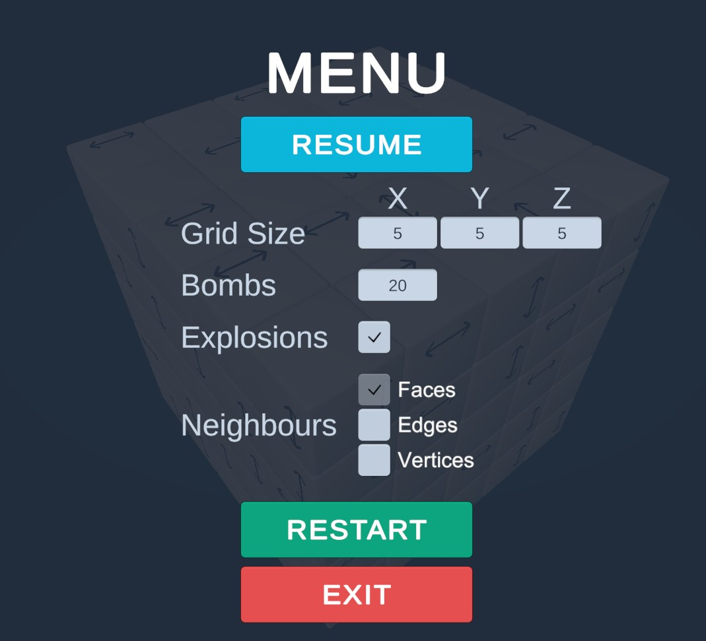
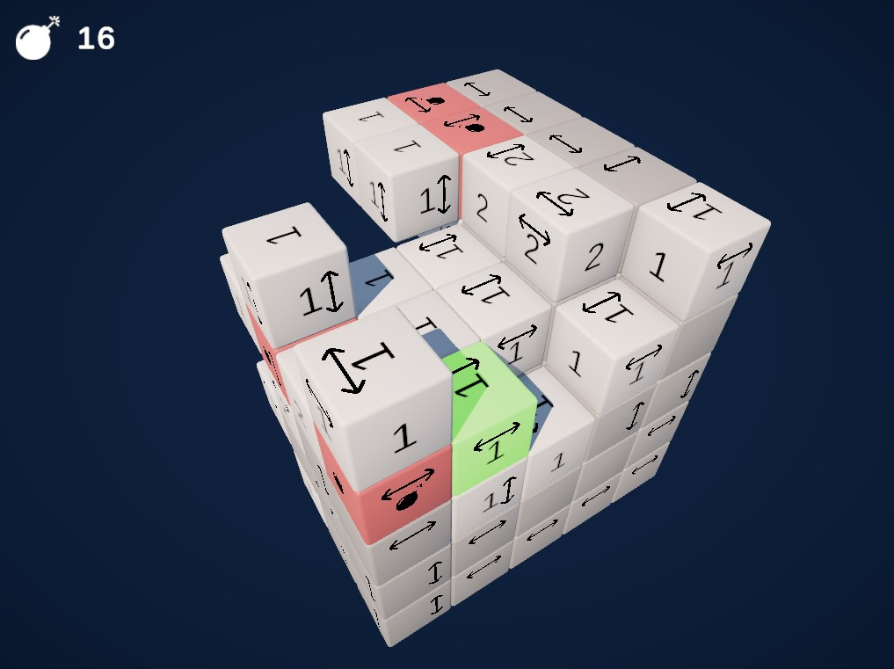
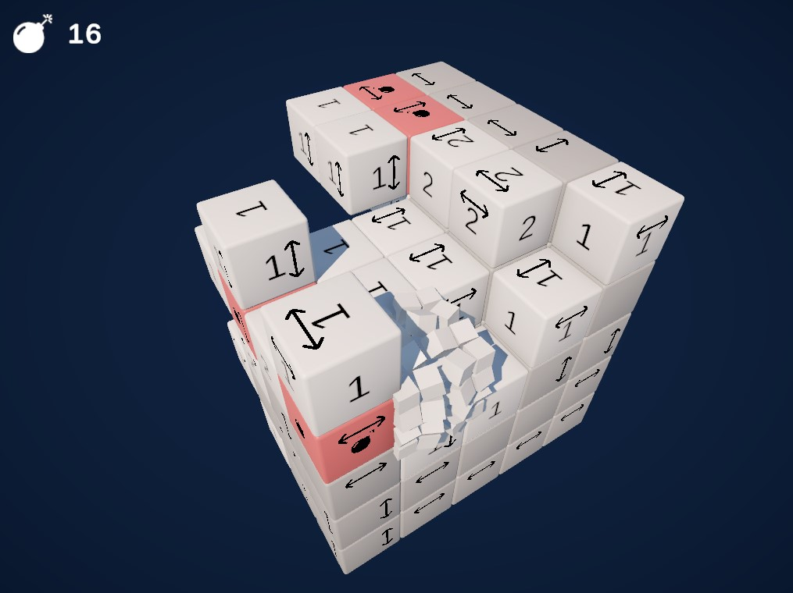

# 3D Minesweeper

This is a small project I made in a few hours to train myself with Unity.

## Download

If you are on Windows x64, you can download the portable archive `3DMinesweeper.zip` and unzip it wherever you want on your computer. Inside the folder, you will find the executable game file `3DMinesweeper.exe`. Run it to play the game (don't move it outside of the root folder, as it depends upon the other files).

You can also find an installer file at `Installer/3DMinesweeper Setup (x64).exe` and run it to locally install the game app.

Otherwise, you can download the full project and build it within Unity (I used version `2022.3.17f1`).

## Play

As in a classic Minesweeper, the goal here is to find all the bombs hidden in the 3D grid.

First, choose the size of the 3D grid (between 3x3x3 and 10x10x10) and the number of bombs (minimum 1). It will change the difficulty. I think that a good challenge is between 15% and 20% of bombs, but try as you like.

> :warning: **Explosions**: when an empty cube is destroyed, it destroys it's neighbouring empty cubes too. The destruction is an explosion that breaks each cube in 4x4x4 small cubes. If you try for example the configuration `Grid Size = 10x10x10` and `Bombs = 1`, you will end up with an explosion of $(10^3 - 7) * 4^3 \approx 63k$ small cubes as soon as you destroy an empty one. You might have some performance issues, or even crash the game. In order to avoid this issue, disable Explosions by unchecking the box, and restart the game with the new parameters. Cubes will simply disappear.

You can choose to also use edges and vertices to consider two cubes as adjacent and detect neighbouring cubes.

Once you start, you have a full 3D grid with grey blocks.

You can rotate the camera around the grid with the key QWSD.

Each of the cube has a double arrow printed on its faces, indicating the direction in which it can move. It is rarely useful, unless you destructed a block somewhere by error and want to place another one to retrieve the number of neighbouring bombs.

In the top left corner, you have the number of the remaining bombs to find.

When you double click on a cube, it will reveal the number of neighbouring bombs. Two cubes are considered neighbour if they have two faces side by side, it does not take into account edges and corners. So at the most, a cube can have 6 neighbours.

If the cube you double clicked has 0 neighbouring bombs, it is destructed and its neighbouring cubes are then revealed. A **revealed cube** appears in white with a number of each face.

You can also right click on a cube and mark it as **flagged** (for now it doesn't do anything except maybe help you visually) or **bombed** with a second click. A **bombed cube** appears in red. You can still remove the mark by right clicking a third time.

While a cube is marked as **bombed**, it cannot be moved nor revealed.

If you double click a **revealed cube** again, it will destroy it.

Another way of destroying a cube is to select it with the left click (the **selected cube** appears in green) and move it outside of the grid by scrolling up or down with your mouse scroll.

:heavy_check_mark: **You win the game** when you have marked all the correct cubes as bombed, and you don't have any more unrevealed cube (either they are revealed, or they are destroyed).

:x: **You lose the game** if you move or reveal a cube that contains a bomb.